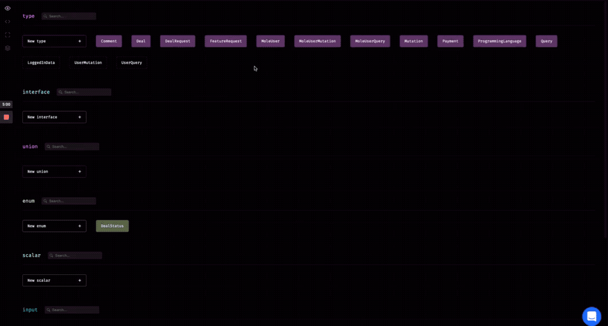
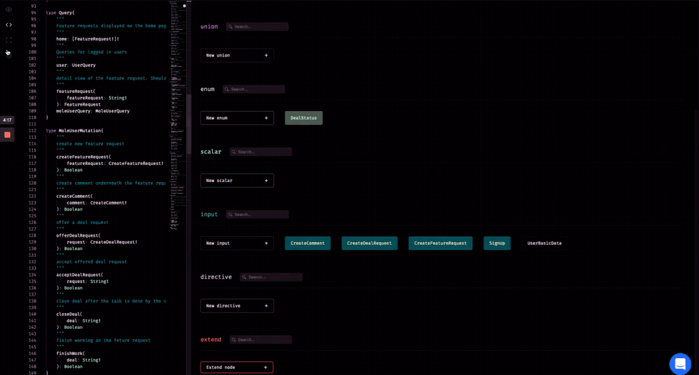

[](https://graphqleditor.com)

[](https://www.npmjs.com/package/graphql-editor) [](http://commitizen.github.io/cz-cli/) [](https://www.npmjs.com/package/graphql-editor)

GraphQLEditor makes it easier to understand GraphQL schemas. Create a schema by using visual blocks system. GraphQL Editor will transform them into code. With GraphQL Editor you can create visual diagrams without writing any code or present your schema in a nice way!

### Cloud version

Here is a [cloud version](https://graphqleditor.com) of GraphQL Editor. 

## How it works

### GraphQL View



### Code Editor View


### Hierarchy View




## Table of contents
- [How it works](#how-it-works)
  - [GraphQL View](#graphql-view)
  - [Code Editor View](#code-editor-view)
  - [Hierarchy View](#hierarchy-view)
- [Table of contents](#table-of-contents)
- [Developer Docs](#developer-docs)
- [License](#license)
- [How It Works](#how-it-works-1)
- [Develop or use standalone](#develop-or-use-standalone)
- [Support](#support)
- [Contribute](#contribute)
- [Team](#team)
- [Underlying Diagram technology](#underlying-diagram-technology)
- [Underlying Parsing technology](#underlying-parsing-technology)
- [GraphQL Tutorials](#graphql-tutorials)

## Developer Docs

If you wish to contribute docs from `typedoc` are availble on [https://graphql-editor.github.io/graphql-editor/](https://graphql-editor.github.io/graphql-editor/)

## License

MIT

## How It Works

Create GraphQL nodes and connect them to generate a database schema. You can also use builtin text IDE with GraphQL syntax validation

## Develop or use standalone

To use standalone you have to use webpack right now. If you want to use it without webpack you need to handle monaco  editor workers yourself.

Install dependencies

```
npm i react react-dom monaco-editor
```

```
npm i -D monaco-editor-webpack-plugin worker-loader css-loader file-loader
```

```
npm i graphql-editor
```

```tsx
import React, { useState } from 'react';
import { render } from 'react-dom';
import { GraphQLEditor,PassedSchema } from 'graphql-editor';

const schemas = {
  pizza:`
type Query{
	pizzas: [Pizza!]
}
`,
pizzaLibrary:`
type Pizza{
  name:String;
}
`
}

export const App = () => {
  const [mySchema, setMySchema] = useState<PassedSchema>({
    code: schemas.pizza,
    libraries: schemas.pizzaLibrary,
  });
  return (
    <div
      style={{
        flex: 1,
        width: '100%',
        height: '100%',
        alignSelf: 'stretch',
        display: 'flex',
        position: 'relative',
      }}
    >
      <GraphQLEditor
        onSchemaChange={(props) => {
          setMySchema(props);
        }}
        schema={mySchema}
      />
    </div>
  );
};

render(<App />, document.getElementById('root'));
```

## Support 

[Join our Discord Channel](https://discord.gg/6QeW7K)

## Contribute

For a complete guide to contributing to GraphQL Editor, see the [Contribution Guide](CONTRIBUTING.md).

1.  Fork this repo
2.  Create your feature branch: git checkout -b feature-name
3.  Commit your changes: git commit -am 'Add some feature'
4.  Push to the branch: git push origin my-new-feature
5.  Submit a pull request

## Team 

[GraphQL Editor Website](https://graphqleditor.com)

## Underlying Diagram technology

Whole graphql-editor is based on underlying [diagram](https://github.com/graphql-editor/diagram) technology.

## Underlying Parsing technology

Whole graphql-editor parsing stuff is based on underlying [zeus](https://github.com/graphql-editor/graphql-zeus) technology.

## GraphQL Tutorials

GraphQL Editor Guide [here](https://guide.graphqleditor.com/)

GraphQL Blog [here](https://blog.graphqleditor.com/)

My Video Blog Tutorials [here](https://stackofthefuture.com)